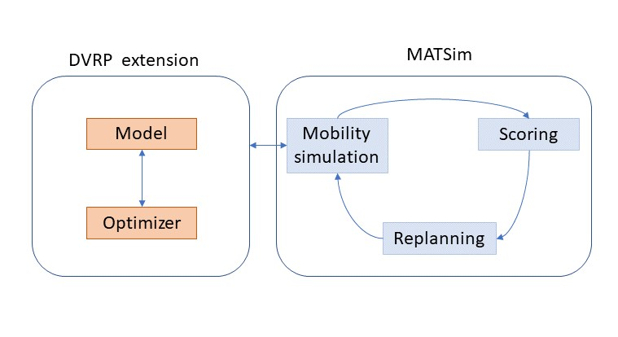

")

# MATSim – Mobility as a Service

This project contains a collection of examples to simulate Mobility as a Service (MaaS) and Mobility on Demand (MoD) in MATSim. All services may be simulated with a driver or using Autonomous Vehicles (AVs). The basic framework for these services are the [Dynamic Vehicle Routing Problem (DVRP)](https://github.com/matsim-org/matsim/tree/master/contribs/dvrp), [Autonomous Vehicles](https://github.com/matsim-org/matsim/tree/master/contribs/av), [Taxi](https://github.com/matsim-org/matsim/tree/master/contribs/taxi) and [Demand Responsive Transport (DRT)](https://github.com/matsim-org/matsim/tree/master/contribs/drt) extensions. This means, vehicles will be dispatched on-line while the MATSim Mobility Simulation is running.

The main goal of the code in this repository is to provide examples of different usage scenarios for MaaS / AV services and make them easy to access in one single place, while the actual optimizer code remains in the MATSim contributions. All the examples run on the current MATSim Snapshot, as there are continuous improvement to the functionality. 

## Functionality

The following extensions might be of particular interest:

### Taxi
The centralized dispatched of Taxi services may be simulated using different algorithms, which may be set in the Config file. An overview of different Taxi dispatch strategies and their performance is provided in: 

*M. Maciejewski; J. Bischoff, & K. Nagel* **An Assignment-Based Approach to Efficient Real-Time City-Scale Taxi Dispatching**, IEEE Intelligent Systems, 2016, 31, 68-77 [Available here](http://svn.vsp.tu-berlin.de/repos/public-svn/publications/vspwp/2016/16-12/)

### Robotaxi / Shared Autonomous Vehicles

Shared Autonomous Vehicles provide the capability to simulate large fleets of automated taxi vehicles. This is done by combining a fast, rule-based dispatch algorithm with the possibility to adjust the consumed road capacity of Autonomous Vehicles. 

The algorithm and results are presented in 
*J. Bischoff, M. Maciejewski* **Simulation of city-wide replacement of private cars with autonomous taxis in Berlin**, Procedia Computer Science, 2016, 83, https://doi.org/10.1016/j.procs.2016.04.121

The effects of different road capacity use are described in 
*M. Maciejewski, J. Bischoff* **Congestion Effects of Autonomous Taxi Fleets**; Transport, 2017, 0, 1-10, [Full text available here](http://dx.doi.org/10.14279/depositonce-7693)

### Demand Responsive Transport (DRT)

Demand Responsive Transport allows the pooling of several passengers into a single vehicle. Several constraints, such as maximum travel times and maximum waiting times, can be taken into account when organizing the vehicle dispatch. 
Please find a full documentation [here](drt.md).

### Autonomous Vehicles

All MaaS extensions may be simulated with and without drivers. Arguably, the biggest influence of AV operations are road capacity and pricing.
* Road capacity can be influenced using the *AVCapacityModule*
* Pricing of MaaS modes can be influenced using Standard MATSim scoring parameters.

## Common infrastructure

With DVRP being the common base to all the modules described here, there is some common infrastructure all of the MaaS modules share:
* The *DVRP config* group. In this, both the Leg mode of an agent using MaaS can be defined (such as "taxi") as well as the network mode vehicles are using (such as "car"). Furthermore, the on-line Travel Time Calculator can be adapted, if required.
* The *Vehicles Container*. This is a file containing information about the fleet used by any MaaS extension. Fleet vehicle files can be created using the *CreateFleetVehicles* script.

## Test scenarios

The [scenarios](scenarios/) folder contains several test scenarios. These are roughly derived from existing MATSim scenarios, but often depict only the excerpt with relevance to MaaS of the scenario. 

## How to use

1) Check out this project using your favorite git client or just download as a zip. As for the latter, you can download:
    - the [development version](https://github.com/matsim-org/matsim-maas/archive/master.zip), which is running using the latest MATSim development snapshot
    - one of the [releases](https://github.com/matsim-org/matsim-maas/releases), which is running using the official MATSim releases
    Using the latest is release will give you relatively stable results, whereas using the master will provide more features, though some of them not thoroughly tested.
  
2) Import the folder as a new Maven project to Eclipse (Import --> Maven --> Existing project) or intelliJ (New --> Module from existing sources --> Select the folder --> Maven)

3) Run the example classes and start editing them according to your taste. You can also run `RunMaasGui` to launch a simple GUI application for running MaaS simulations.
